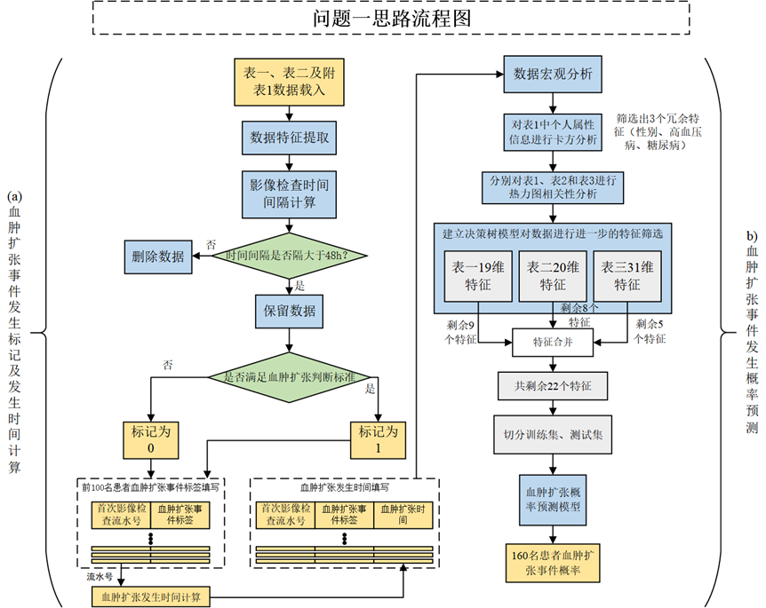
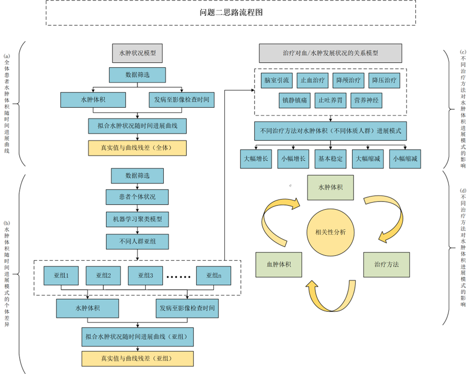
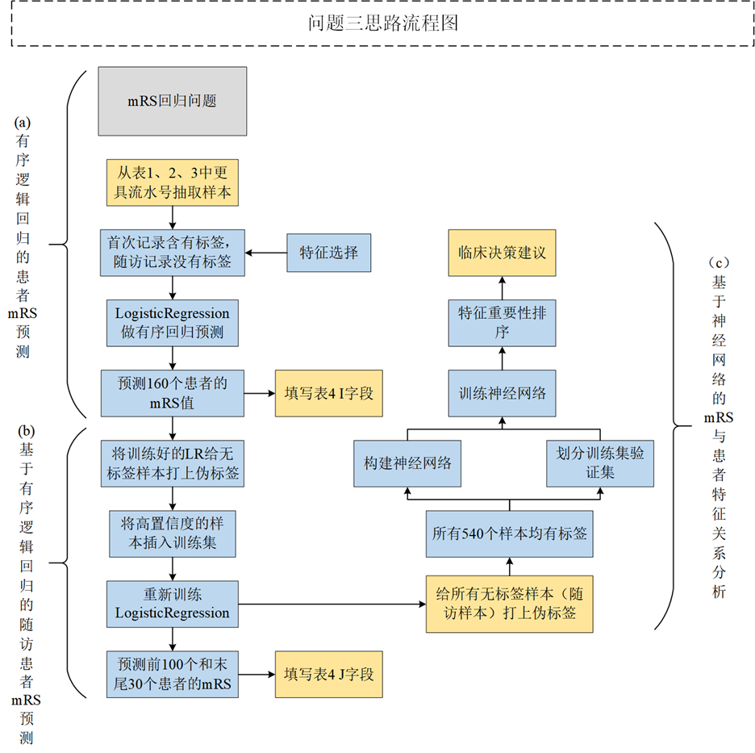
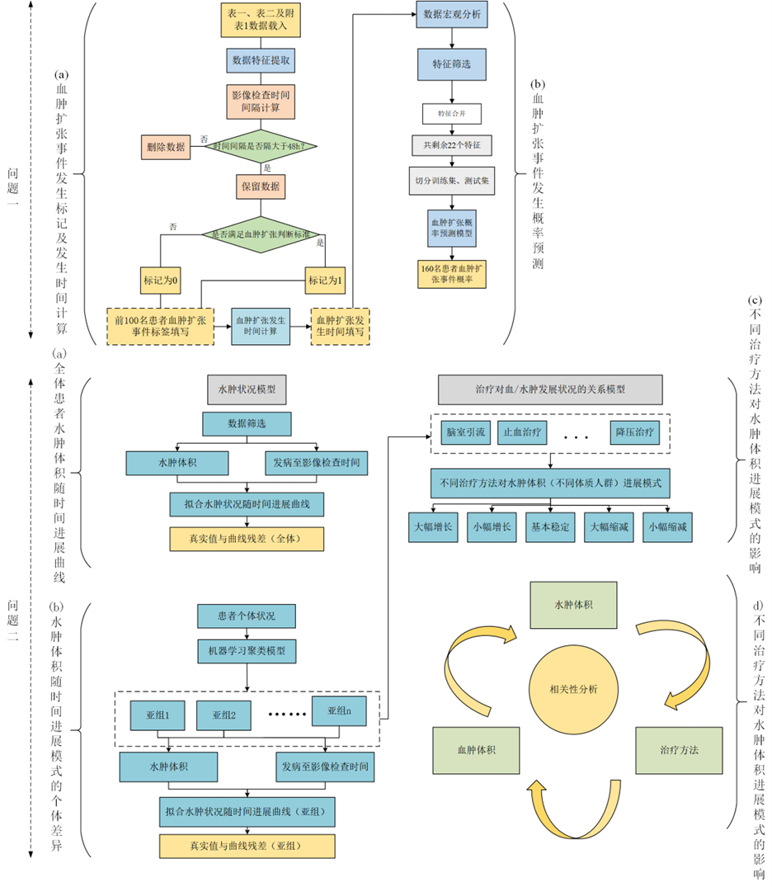
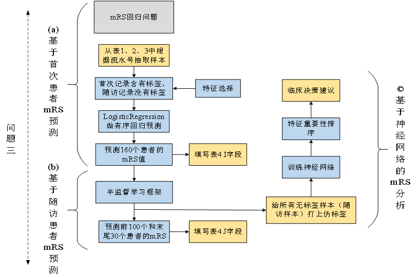

# “华为杯”第二十届中国研究生数学建模竞赛—E题

<h1 style="text-align: right;">———基于机器学习的出血性脑卒中临床智能诊断模型</h1>

## __竞赛成绩：全国三等奖__

### 竞赛成员：zfg（队长），lz，lc

## __竞赛背景：__

出血性脑卒中是指非外伤性脑实质内血管破裂引起的脑出血，占全部脑卒中的10\-15%。其病因复杂，通常由脑动脉瘤破裂、脑动脉异常等引发，导致血液涌入脑组织，造成机械性损伤和一系列病理反应。出血性脑卒中起病急、进展快，预后差，急性期内病死率高达45\-50%，约80%的患者会遗留严重的神经功能障碍，给社会和患者家庭带来沉重负担。血肿范围扩大和血肿周围水肿是预后不良的重要危险因素，监测和控制血肿扩张以及识别和预测水肿的发生对于改善患者预后具有重要意义。医学影像技术和人工智能技术的发展为无创动态监测和智能分析提供了新机遇，期望通过影像信息、患者信息、治疗方案和预后数据，构建智能诊疗模型，实现精准个性化的疗效评估和预后预测，为改善出血性脑卒中患者的预后作出贡献。

## __竞赛题目：__

__1，血肿扩张风险相关因素探索建模。__

（a）请根据“表1”（字段：入院首次影像检查流水号，发病到首次影像检查时间间隔），“表2”（字段：各时间点流水号及对应的HM\_volume），判断患者sub001至sub100发病后48小时内是否发生血肿扩张事件。

结果填写规范：1是0否，填写位置：“表4”C字段（是否发生血肿扩张）。

如发生血肿扩张事件，请同时记录血肿扩张发生时间。

结果填写规范：如10\.33小时，填写位置：“表4”D字段（血肿扩张时间）。

是否发生血肿扩张可根据血肿体积前后变化，具体定义为：后续检查比首次检查绝对体积增加≥6 mL或相对体积增加≥33%。

注：可通过流水号至“附表1\-检索表格\-流水号vs时间”中查询相应影像检查时间点，结合发病到首次影像时间间隔和后续影像检查时间间隔，判断当前影像检查是否在发病48小时内。

（b）请以是否发生血肿扩张事件为目标变量，基于“表1” 前100例患者（sub001至sub100）的个人史，疾病史，发病相关（字段E至W）、“表2”中其影像检查结果（字段C至X）及“表3”其影像检查结果（字段C至AG，注：只可包含对应患者首次影像检查记录）等变量，构建模型预测所有患者（sub001至sub160）发生血肿扩张的概率。

注：该问只可纳入患者首次影像检查信息。

结果填写规范：记录预测事件发生概率（取值范围0\-1，小数点后保留4位数）；填写位置：“表4”E字段（血肿扩张预测概率）。

__2，血肿周围水肿的发生及进展建模，并探索治疗干预和水肿进展的关联关系。__

（a）请根据“表2”前100个患者（sub001至sub100）的水肿体积（ED\_volume）和重复检查时间点，构建一条全体患者水肿体积随时间进展曲线（x轴：发病至影像检查时间，y轴：水肿体积，y=f\(x\)），计算前100个患者（sub001至sub100）真实值和所拟合曲线之间存在的残差。

结果填写规范：记录残差，填写位置“表4”F字段（残差（全体））。

（b）请探索患者水肿体积随时间进展模式的个体差异，构建不同人群（分亚组：3\-5个）的水肿体积随时间进展曲线，并计算前100个患者（sub001至sub100）真实值和曲线间的残差。

结果填写规范：记录残差，填写位置“表4”G字段（残差（亚组）），同时将所属亚组填写在H段（所属亚组）。

（c）请分析不同治疗方法（“表1”字段Q至W）对水肿体积进展模式的影响。

（d）请分析血肿体积、水肿体积及治疗方法（“表1”字段Q至W）三者之间的关系。

__3，出血性脑卒中患者预后预测及关键因素探索。__

（a）请根据前100个患者（sub001至sub100）个人史、疾病史、发病相关（“表1”字段E至W）及首次影像结果（表2，表3中相关字段）构建预测模型，预测患者（sub001至sub160）90天mRS评分。

注：该问只可纳入患者首次影像检查信息。

结果填写规范：记录预测mRS结果，0\-6，有序等级变量。填写位置“表4”I字段（预测mRS（基于首次影像））。

（b）根据前100个患者（sub001至sub100）所有已知临床、治疗（表1字段E到W）、表2及表3的影像（首次\+随访）结果，预测所有含随访影像检查的患者（sub001至sub100,sub131至sub160）90天mRS评分。

结果填写规范：记录预测mRS结果，0\-6，有序等级变量。填写位置“表4”J字段（预测mRS）。

（c）请分析出血性脑卒中患者的预后（90天mRS）和个人史、疾病史、治疗方法及影像特征（包括血肿/水肿体积、血肿/水肿位置、信号强度特征、形状特征）等关联关系，为临床相关决策提出建议。

## 建模解题方案：

__1，针对问题1：重点结合表1和表2数据，对血肿扩张风险相关因素构建相关模型。__

（a）题依据血肿扩张的的体积与发生扩张的时间建立血肿扩张事件判别模型，得到48h内发生血肿扩张的患者，及发生血肿扩展的时间。

（b）题首先卡方分析对表一个人属性特征进行分析，过滤掉3个特征（性别、高血压、糖尿病），通过相关性热力图筛选特征，随后利用决策树分别对表1、表2、表3进行特征过滤，最后对特征进行融合得到剩余的22个特征，再利用训练好的随机森林模型对所有患者进行血肿扩张概率预测。

__2，针对问题2：主要针对血肿周围水肿的发生进行模型的建立，研究不同治疗方法对水肿进展的关联关系。__

（a）题需对前100名患者构建全体患者水肿体积随时间的变化曲线，并同时获得前100名患者真实值与曲线的残差。本文主要通过建立多项式回归模型对全体患者水肿体积数据取对数变换后，对其散点进行拟合。其拟合曲线可体现出全体患者水肿体积随时间变化的整体趋势。对数反变换后计算每位患者残差绝对值的平均，作为最终的残差值。

（b）题重点需针对水肿体积进展模式的概念进行研究，同时对患者按亚组分类分析。首先由模糊C均值聚类模型将患者分割为4个亚组，对于每个亚组的水肿体积分布，分别由多项目回归模型进行曲线的拟合。并由（a）中方法计算其残差值。

（c）题通过支持向量回归模型对水肿体积进展分亚组进行研究。主要采用水肿体积增长速率以表示水肿体积的进展模式。随后将不同的治疗方法作为样本数据的特征，水肿体积增长速率为对应患者的标签，进行支持向量回归模型的训练。针对不同类型的患者，得到不同治疗方法对于水肿体积进展的影响。

（d）题首先通过斯皮尔曼相关性分析对患者血肿与水肿二者进行分析，后续由不同疗法分别对患者水肿、血肿进行研究。其次，由支持向量回归模型由（c）思路进行研究，最后通过随机森林回归模型对患者血肿进展模型进行研究。综合上述分析，便可得到治疗方法与患者血肿、水肿的关系。

__3，针对问题3：主要研究个人史、疾病史、发病相关数据及首次影像结果与患者mRS评分的关系模型。特征筛选后进行后续处理。__

（a）题考虑前100名患者的个人史、疾病史、发病相关以及首次影像的结果建立模型，预测全体患者的90天mRS评分。通过数据特征筛选去除无关特征，保留有效特征进行后续处理。随后，建立有序逻辑回归模型预测患者的mRS评分。

（b）题首先通过数据精细化处理，解决不同患者随访次数不同，所导致的数据特征长度不一致的情况，并采用半监督伪标签训练策略，对整体数据集进行扩充。并对所有含随访影像检查的患者90天mRS评分进行预测，提高了最终预测的精度。

（c）题在（b）题扩充数据的基础上，建立反向传播神经网络模型。对（b）中扩充后的数据，进行模型的训练。最终获取模型架构的权重参数，以得到输入数据的特征重要性程度。以供临床决策的借鉴。

针对上述各题，结合医学实际所建立的出血性脑卒中临床智能诊疗模型均与相关模型进行多指标的对比分析，可证明建立模型的有效性，以及各模型对各问题的适用性。

## __模型建立：__

__问题一：血肿扩张风险相关因素探索建模__

**（a),本题需分析表1、表2和附表1的相关数据，需建立血肿扩张事件判别模型：**计算出前100名患者在48h内是否发生血肿扩张，同时记录各患者血肿扩张发生时间。

**（b),**__基于随机森林的血肿预测模型：__本题需将（a）题中的血肿是否扩张事件定义为标签数据，提取表1、表2及表3中前100名患者的个人及影像特征数据，建立血肿扩张概率预测模型，对全体患者患者预测发生血肿扩张的概率。

  

__问题二：血肿周围水肿的发生及进展建模，并探索治疗干预和水肿进展的关联关系__

__（a),基于多项式回归的水肿状况模型建立：__分析表2中前100名患者的水肿体积和重复检查时间点，拟合一条符合全体患者水肿体积变化规律的时间进展曲线，并计算真实值与所拟合曲线之间的残差数值。

**（b),基于FCM的亚组水肿进展模型建立：**分析患者水肿体积随时间变化而产生的个体差异，分亚组建立人群的水肿体积变化趋势曲线，并计算前100名患者的残差。

**（c),**__基于SVR的疗法对水肿状况模型建立：__建立模型分析不同治疗方法对水肿体积变化的影响。

**（d),基于随机森林的疗法与血肿、水肿关系模型建立：**建立模型分析血肿体积、水肿体积及治疗方法三者之间的关系。

  

__问题三：出血性脑卒中患者预后预测及关键因素探索__

**（a),基于有序逻辑回归的患者mRS预测模型：**分析前100名患者的信息及影像数据，预测160名患者的90天mRS评分。

**（b),**__基于有序逻辑回归的随访患者mRS预测模型：__分析前100名患者所有已知临床、治疗及影像结果，对所有患者90天mRS评分。

**（c),**__基于神经网络的mRS与患者特征关系模型：__结合血性脑卒中患者的预后、病理信息及影像数据，分析它们的关联关系，同时提出相关建议指导临床决策。

  

## 整体方案流程：

  

  

## __模型求解：见代码__

**picture: 解题思路流程图**

**result: 模型运行结果**

**main\.py: 解题模型代码；其中def Q\_1a\(\)、def Q\_1b\(\)对应为解题的模型函数，其他def Q\_xx 含义相似，以此类推。**

__	__

